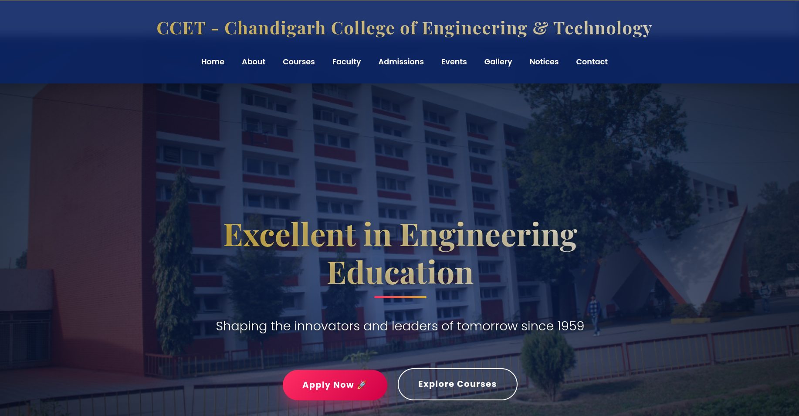
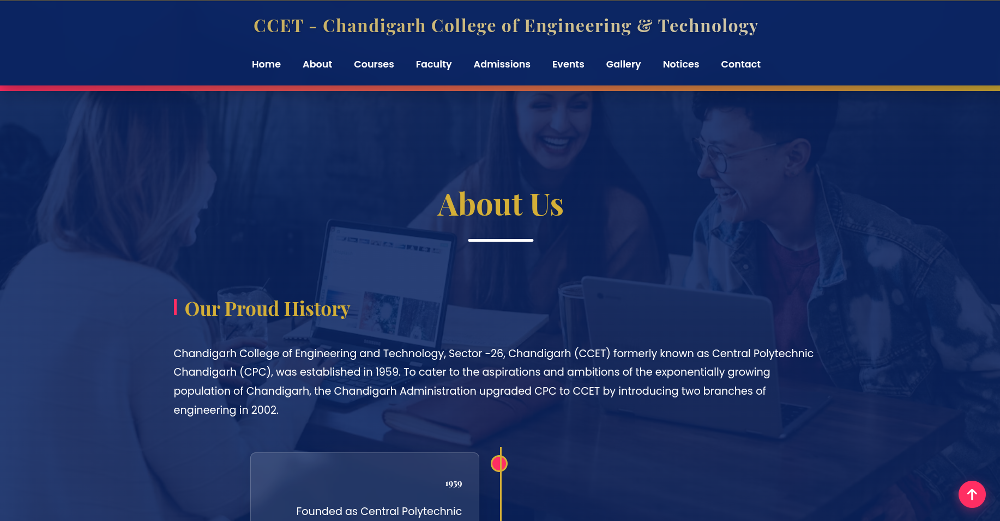
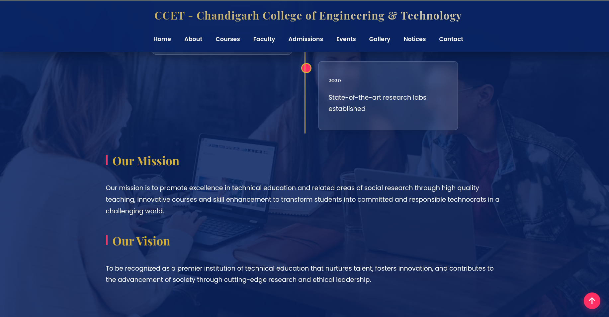
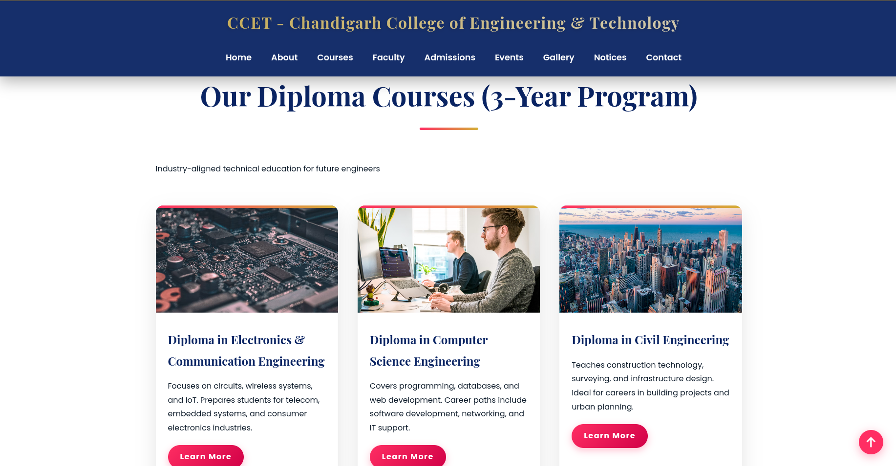
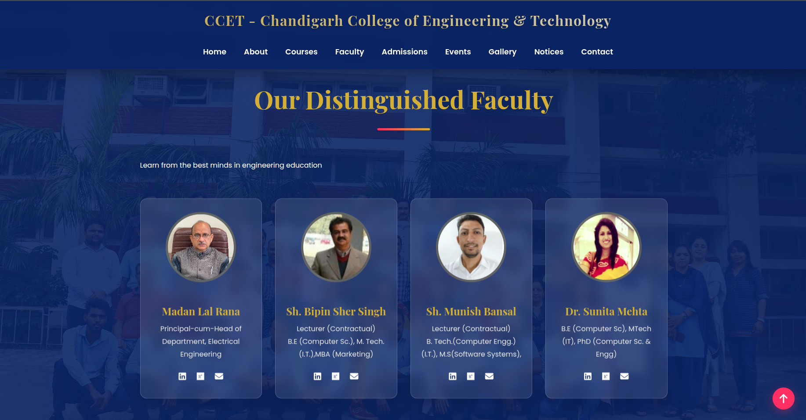
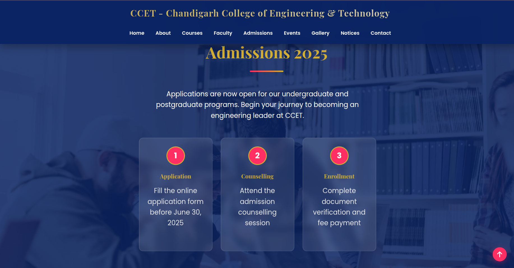
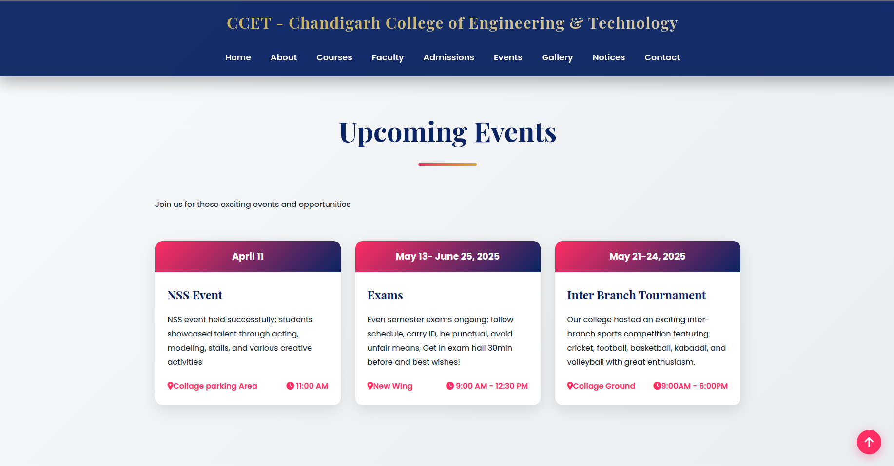
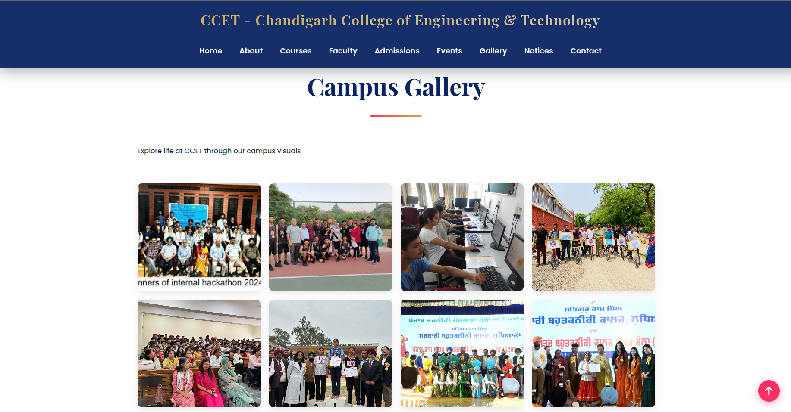
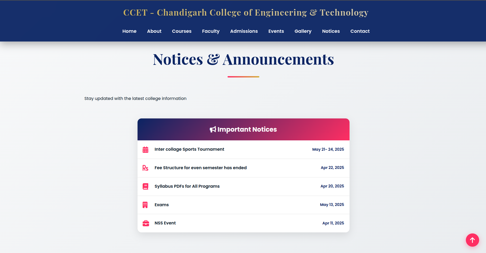
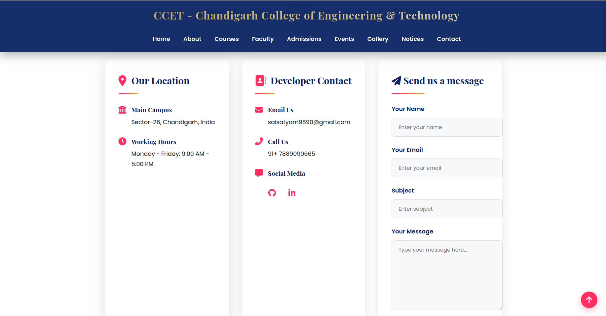

# CCET College Website

## Overview

This project is a modern and responsive college website developed as part of my web development practice. The goal was to improve my frontend development skills by building a complete website that resembles a real educational institution's website while maintaining a clean and professional design.

## Live Demo

- **Frontend (Netlify):**
  https://friendly-peony-f52668.netlify.app

- **Backend API (Railway):**
  https://college-website-production-93ba.up.railway.app

- **API Documentation (Swagger UI):**
  https://college-website-production-93ba.up.railway.app/docs

The project includes multiple sections commonly found on college websites such as courses, faculty, admissions, events, gallery, notices, and contact information. It also includes a simple FastAPI backend to gain experience with frontend and backend integration.

**Note:** This is an independent educational portfolio project. It is not the official website of Chandigarh College of Engineering and Technology (CCET).

---

## Features

- Responsive design for desktop, tablet, and mobile devices
- Modern user interface with animations and transitions
- Home page with hero section
- About section
- Courses section
- Faculty section
- Admissions section
- Events section
- Gallery
- Notice board
- Contact section
- Developer contact information
- FastAPI backend integration
- Clean and organized project structure

---

## Technologies Used

### Frontend

- HTML5
- CSS3
- JavaScript

### Backend

- Python
- FastAPI
- Mysql

### Tools

- Visual Studio Code
- Git
- GitHub

---

## Project Structure

```text
Collage_website/

│
├── backend/
│   ├── main.py              # FastAPI application
│   ├── database.py          # SQLAlchemy engine & DB connection
│   ├── models.py            # Contact table model
│   ├── schemas.py           # Pydantic request schemas
│   ├── requirements.txt     # Python dependencies
│  
│
├── frontend/
│   ├── UI/
│       ├── index.html       # Main webpage
│       ├── style.css        # Styling
│       └── script.js        # JavaScript + FastAPI fetch()
│       │
│       ├── images/              # Student images.
│       └── background_images/   # Background photos
│
├── README.md
└── runtime.txt (contains the python version)
```

---

## Installation

Clone the repository

```bash
git clone https://github.com/YOUR_USERNAME/CCET-College-Website.git
```

Navigate to the project folder

```bash
cd CCET-College-Website
```

Install the required packages

```bash
pip install -r requirements.txt
```

Run the FastAPI server

```bash
uvicorn app:app --reload
```

Open the frontend using Live Server or open the `index.html` file in your browser.

---

## Screenshots

### Home Page



---

### About Section





---

### Courses Section



---

### Faculty Section



---

### Admissions Section



---

### Events Section



---

### Gallery



---

### Notice Board



---

### Contact Section



---


## Project Contributions

This project was developed as part of a college group project.

My primary contributions included:

- Frontend development using HTML and CSS
- Responsive layout implementation
- UI/UX design improvements
- Website structure and styling
- Project organization
- Testing and refinement

The JavaScript functionality and some interactive behaviors were primarily implemented by my project partner.

The project was later maintained and customized by me as part of my personal portfolio.

## What I Learned

This project helped me improve my understanding of:

- Responsive web design
- HTML page structure
- CSS layouts and animations
- UI/UX design principles
- FastAPI backend development
- Organizing a full web development project
- Using Git and GitHub for version control

---

## Future Improvements

Some features I plan to add in future versions include:

- Student login system
- Online admission form
- Database integration
- Admin dashboard
- Dynamic notices and events
- Image optimization
- Better accessibility support

---

## Developer

Sai Satyam Biswal

Email

- saisatyam9890@gmail.com


LinkedIn
[
https://www.linkedin.com/in/sai-satyam](https://www.linkedin.com/in/sai-satyam-68b796387/)

If you have any questions or feedback about this project, feel free to contact me.

---

## Disclaimer

This project was created for educational and portfolio purposes only.

It is not affiliated with, endorsed by, or maintained by Chandigarh College of Engineering and Technology (CCET). All institutional names, logos, and publicly available information belong to their respective owners.

---

## License

This project is available for educational and portfolio purposes only.
